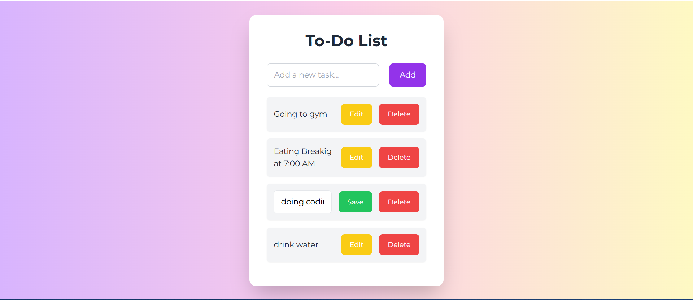

# 📝 To-Do List App

A modern and responsive To-Do List application built with **React**, **Redux Toolkit**, and **Vite**. This app allows users to add, complete, delete, and filter tasks in an intuitive way.

## 🚀 Live Demo

🔗 [View Live on Vercel](https://your-vercel-url.vercel.app)

## 🛠️ Tech Stack

- **React**: JavaScript library for building user interfaces.
- **Redux Toolkit**: For state management.
- **Vite**: Next-generation, fast build tool.
- **JavaScript (ES6+)**: The main language used in the project.
- **Tailwind CSS**: For styling and responsive design.

## 📌 Features

- ✅ Add new tasks
- 🗑️ Delete individual tasks
- 🗑️ Edit individual tasks
- 📱 Fully responsive UI for desktop and mobile screens
- 🎨 Modern UI with smooth transitions

## 📂 Folder Structure

src/
├── app/                # Redux store configuration
├── components/         # Reusable UI components (e.g., TodoItem, TodoForm)
├── features/           # Redux slices (e.g., todosSlice)
├── pages/              # Main pages 
├── App.jsx             # Main application component
├── main.jsx            # Entry point for the app
└── index.css           # Global styles

## 🔧  Installation

1. Clone the Repository
Clone the project to your local machine using Git:

git clone https://github.com/faria-webdev404/todo-list-react-redux-toolkit.git

2. Install Dependencies
Navigate into the project directory and install all required dependencies:

 cd todo-list-react-redux-toolkit
 npm install

3. Run the Development Server
Start the development server to view the app locally:

 npm run dev

📝 Usage

How to Use the App

Add a Task: Enter a task name in the input field and click the "Add" button to add it to the list.

Edit a Task: Click the "Edit" button to change the text of an existing task.

Delete a Task: Click the "Delete" button to remove a task from the list.

📸 Screenshots

## 📸 Screenshot

📑 License
This project is open-source and available under the MIT License.

🤝 Contributing

Contributions, issues and feature requests are welcome!
Feel free to fork the repo and submit a pull request.

🙋‍♀️ Author

 Made by Faria Abid
 
 💬 Contact

If you have any questions or feedback, feel free to reach out to me:

Email: [fariaabid473@gmail.com]

